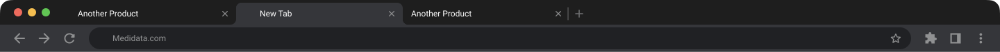

# Lesley Rooney — Portfolio Site

Static portfolio site deployed on Cloudflare Pages via GitHub.
Built with plain HTML, CSS, and vanilla JS. No framework. No build step.

## Repo
GitHub: lrooney-portfolio
Production: https://lrooney.com

## How deployment works
Push to GitHub main branch → Cloudflare Pages auto-deploys. No manual steps needed.

## Folder structure
```
/                        — root
├── index.html           — homepage (work card grid + hero)
├── influence.html       — influence page
├── password.html        — Cloudflare Pages password gate
├── coming-soon.html     — coming soon placeholder
├── CLAUDE.md            — this file (not deployed)
├── /functions           — Cloudflare Pages serverless functions
│   ├── _middleware.js   — password protection middleware
│   └── check-password.js — password validation endpoint
├── /specs               — case study build briefs (not deployed)
│   ├── EDC-case-study-spec.md
│   ├── Qflow-case-study-spec.md
│   ├── Qflow-notifications-spec.md
│   ├── Risk-management-spec.md
│   ├── HomeRenter-spec.md
│   └── Games-VFX-spec.md
├── /images              — all static images (.webp preferred)
├── /videos              — preview/hover videos
└── /styles              — CSS files
```

## Case study pages
Read the relevant spec file in /specs before building or editing any of these.

| Page URL | Spec file | Status |
|---|---|---|
| /medidataedcredesign | EDC-case-study-spec.md | ✅ Built · password protected |
| /contech-qflow | Qflow-case-study-spec.md | ✅ Built |
| /qualisflow-02 | Qflow-notifications-spec.md | ✅ Built · password protected |
| /clinical-risk-based-monitoring | Risk-management-spec.md | ✅ Built · password protected |
| /homerenter | HomeRenter-spec.md | ✅ Built |
| /lesleyrooney-games-sims-vfxworks | Games-VFX-spec.md | ✅ Built |

Note: `games-simulations-films.html` also exists as an alternate URL for the Games/VFX page.

## Shared components (build once, import across all case study pages)
Build these first before any case study pages.

- **IconRow** — horizontal strip of tool logos with labels
- **PeekGrid** — footer thumbnail grid, 8–9 square thumbnails, hover reveals a peek of the case study
- **Carousel** — image slideshow with prev/next arrows, used heavily in EDC and HomeRenter
- **LightboxGallery** — click image to open fullscreen with prev/next navigation, used in Games/VFX
- **HoverReveal** — hover a thumbnail to reveal a second image or video beneath
- **HoverAudio** — hover a thumbnail to play a short audio clip (2 min max)
- **AudioPlayer** — standalone audio player with play/pause and progress bar (EDC only — NotebookLM podcast)

## Design conventions
- Mobile-first CSS
- No jQuery — vanilla JS only
- Images: .webp format preferred, export at 2× for retina
- Fonts: match whatever is currently in index.html — do not change typography without asking
- Colour palette: do not change site colours without asking
- Do not add frameworks or npm packages without asking first

## NDA / password cases
- NDA cases: show a blurred placeholder image + lock icon. Do not display actual screens.
- The lock icon and "NDA" label are already used on the homepage cards — match that pattern
- Password protection is enforced server-side via Cloudflare Pages middleware (`/functions/_middleware.js`)
- Protected pages: `/medidataedcredesign`, `/clinical-risk-based-monitoring`, `/qualisflow-02`
- Auth is cookie-based (`cfp_auth=1`); unauthenticated visitors are redirected to `/password.html`

## Animation (check current state of index.html before adding or changing)
- Lenis for smooth scroll
- GSAP + ScrollTrigger for scroll-driven animations
- Animations should be subtle — professional portfolio, not a showreel

### h1 hero text
- Markup is manually split into `<span class="h1-word">` and `<span class="h1-char">` — no SplitText plugin (paid)
- "Hi," fades in at 180ms, "I'm" at 430ms, "Lesley" letter-by-letter: delay 710ms, duration 350ms, stagger 80ms per letter
- CSS: `.h1-word { display: inline-block; }` and `.h1-char { display: inline-block; }`
- **Do NOT add a ScrollTrigger fade-out on `.hero h1`** — this was tried and removed. The h1 sits too close to the top of the viewport; the trigger fires before scrollY=0 and leaves the h1 at ~0.5 opacity at the top of the page.

### work cards (IntersectionObserver, not GSAP)
- Cards start: `opacity: 0; transform: translateY(32px); transition: opacity 0.55s ease, transform 0.55s ease`
- IntersectionObserver adds `in-view` class: `opacity: 1; transform: translateY(0)`
- Custom per-card stagger delays (not a uniform formula):
  - Row 1: card 0 → 0ms, card 1 → 180ms, card 2 → 350ms
  - Row 2: card 3 → 0ms, card 4 → 170ms, card 5 → 350ms

### "I'm an introvert" particle morph (homepage hero)
The `<em>` text "I'm an introvert" inside `.hero-intro` morphs from a swarm of small particles into the rendered word. Triggered after the Rive person animation completes (`triggerPersonAnimation`).

- **Reversible feature flag** in `index.html`: `var INTROVERT_PARTICLE_MORPH = true;` — set to `false` to fall back to the plain fade-in. Do not delete the flag or the legacy fade path
- Implementation: `runIntrovertParticleMorph(em)` builds an off-screen canvas, samples pixel alpha to find target points, then animates each particle from a random start (orbit / top / bottom / left / right / diagonals) into place
- Tuning: 1–2px particles, ~12% orbit / 88% directional, `motionDuration = 0.38s`, ease-out quadratic. Keep it quick and subtle — slower easing felt unnatural
- The canvas (`#introvert-particle-canvas`) is cleaned up by the bfcache `pageshow` handler

### bfcache / hash-navigation fixes
- `pageshow` event handler handles bfcache restore (`e.persisted`): removes `#pt-overlay`, scrolls to top, clears GSAP props on `.hero`, `.hero h1`, `.h1-word`, `.h1-char`, `.hero-intro`, `.intro-block`, then calls `ScrollTrigger.refresh()`
- Hash navigation fix (e.g. clicking "Work" from a case study → `/#work`): on DOMContentLoaded, any `.intro-block` elements that are already above the viewport (start position above current scroll) get `in-view` class added immediately, bypassing IntersectionObserver

## Design system — named patterns

### top nav

Two behaviours, one shared style system.

**Shared font styles (both variants):**
- Logo: `font-family: var(--serif); font-size: 1rem; font-weight: 600; color: var(--ink); text-decoration: none;`
- Links: `font-size: 0.8rem; font-weight: 500; color: var(--ink); letter-spacing: 0.06em; text-transform: uppercase; text-decoration: none; transition: opacity 0.2s;`
- Links hover: `opacity: 0.5`
- Nav background: `rgba(253, 253, 252, 0.30)` with `backdrop-filter: blur(20px)` and `-webkit-backdrop-filter: blur(20px)`
- Border bottom: `1px solid var(--rule)`

**Variant 1 — Homepage scroll nav (`#home-nav`)**
- `position: fixed; top: 0; left: 0; right: 0; z-index: 100`
- Hidden on load (`opacity: 0; pointer-events: none`)
- Fades in (no slide) via GSAP when scrollY reaches 260px — triggered when "Hi, I'm Lesley" h1 is no longer visible
- Fades out when scrolling back up past that point
- Links: Influence · About · Get in Touch (no Work link on homepage)
- Hidden on mobile (`display: none` below 900px)
- Inner layout: `max-width: var(--max); height: 56px; display: flex; align-items: center; justify-content: space-between; padding: 0 48px`

**Variant 2 — Case study persistent nav (`#nav`)**
- `position: fixed; top: 0; left: 0; right: 0; z-index: 100`
- Always visible (no scroll trigger)
- Links: Work · Influence · About · Get in Touch
- May include optional audio controls (`#nav-audio-controls`) — narration play/pause pill, shown only on EDC page
- CSS classes: `.nav-logo`, `.nav-links`, `.nav-right`

### image card (aka img-card rules, apply to ALL case study pages)
- `padding: 20px` on all sides
- No border (`border: none` — borders were removed from the design system)
- `border-radius: 16px`, `background: var(--faint)`
- `.img-card .cs-caption` → `margin: 0 0 8px; font-size: 0.82rem` (caption sits **above** the image)
- `.img-card img` → `border-radius: 8px`
- `.img-card` margin: `56px 0` — the standardised vertical gap between body text and media (set per-page in each `<style>` block)

**Scroll-reveal animation (required on all case study pages)**
Images, videos, post-it notes, and their description text all fade in and slide up when they enter the viewport. The animation is **centralised** — do not add inline CSS or JS to individual pages.

**CSS** lives in `styles/components.css` (already loaded by all case study pages):
```css
.img-card, .postit, .gif-item, .video-wrap, .img-pair, .cs-caption, .reveal {
  opacity: 0;
  transform: translateY(56px);
  transition: opacity 0.65s cubic-bezier(0.16, 1, 0.3, 1),
              transform 0.65s cubic-bezier(0.16, 1, 0.3, 1);
}
.img-card.in-view, .postit.in-view, .gif-item.in-view, .video-wrap.in-view,
.img-pair.in-view, .cs-caption.in-view, .reveal.in-view {
  opacity: 1;
  transform: translateY(0);
}
```

**JS** lives in `js/scroll-reveal.js`. Add one script tag before `</body>` on any new page:
```html
<script src="./js/scroll-reveal.js"></script>
```

- Threshold `0.08` — triggers when 8% of the element is visible
- Animates once only (`unobserve` after trigger)
- **Above-the-fold guard** — elements already in the viewport on load get `in-view` immediately, no flash of invisible content
- Use `.reveal` on any standalone ``, `<video>`, or wrapper that isn't one of the named classes above
- New pages also need `<link rel="stylesheet" href="./styles/components.css">` in `<head>` if not already present
- Live on: all case study pages (`medidataedcredesign.html`, `contech-qflow.html`, `homerenter.html`, `clinical-risk-based-monitoring.html`, `qualisflow-02.html`, `lesleyrooney-games-sims-vfxworks.html`)

**Grid stagger heuristic (image-likes only):**
When 2+ image-like siblings (`.img-card, .video-wrap, .gif-item, .img-pair, .reveal`) share a parent, each gets a `transition-delay` of `index × 110ms` so they cascade in. Single image-likes and any `.cs-caption`/`.postit` reveal with no delay so the slide-up motion is always visible. Logic lives in `gridStaggerMs()` inside `js/scroll-reveal.js` — do not duplicate per-page.

**`.reveal-quick`** — faster variant for sections lower in the page where the standard slide feels slow:
```css
/* in components.css */
.reveal-quick { transform: translateY(24px); transition-duration: 0.38s; }
.reveal-quick.in-view { transform: translateY(0); }
```
- Used on contech-qflow sections 21+ (from the Design System Gallery section onwards)
- Apply by adding `reveal-quick` alongside `reveal` on the section element: `class="cs-section reveal-quick"`
- Children inside a `.reveal` or `.reveal-quick` section animate as a group (not individually) — override in components.css: `.reveal .img-card { opacity: 1; transform: none; transition: none; }`

### postit note (aka postit-over-image)
When a caption needs to sit over/below an image as a sticky note:
1. Wrap the image/video card in a `position: relative` container with enough `margin-bottom` to clear the postit (typically `margin-bottom: [postit-bottom-offset + postit-height]px`)
2. Place the postit absolutely inside that wrapper:
```html
<div style="position: relative; display: flex; justify-content: center; margin-bottom: 260px;">
  <div class="img-card" style="width: 70%; padding: 20px; box-sizing: border-box;">
    <!-- image or video here -->
  </div>
  <div class="postit postit--2" style="position: absolute; bottom: -248px; right: 10%; width: 260px; z-index: 2;">
    <p><strong>Key phrase</strong> rest of caption text.</p>
  </div>
</div>
```
- Use `.postit--1` through `.postit--5` for subtle rotation variants
- `right: 10%` positions it bottom-right; adjust as needed
- Bold the key phrase with `<strong>` inside the `<p>`
- To override a class rotation, add `transform: rotate(Ndeg)` inline (e.g. to flip direction)
- To align two side-by-side postits at the same height, use matching `bottom: -Npx` values (not `top:`)
- For postits that should overlap the bottom edge of the image, use a negative `bottom` value smaller than the image height

### info card (persona / list card)
Used for "Meet the Users" persona sections and grouped list cards (e.g. Sites, Client Side).
- `background: #E7F2FE` — matches the business outcomes card colour from EDC redesign
- `border-radius: 16px; padding: 16px 20px`
- Label: `<p class="persona-section-label">` — small uppercase label above the list
- List: `<ul class="persona-list">` — no bullet, emoji + bold name + dash + description

```html
<div style="background: #E7F2FE; border-radius: 16px; padding: 16px 20px;">
  <p class="persona-section-label">Section Label</p>
  <ul class="persona-list">
    <li>🧑🏻‍⚕️ <strong>Role Name</strong> — Description of what they do.</li>
  </ul>
</div>
```

### postit (standard row layout)
```html
<div class="postit-row">
  <div class="postit postit--1"><span class="postit-emoji">🧍</span><p>Text</p></div>
  <div class="postit postit--2"><span class="postit-emoji">📊</span><p>Text</p></div>
  <div class="postit postit--3"><span class="postit-emoji">💡</span><p>Text</p></div>
</div>
```
Rotation: --1 = -2deg, --2 = 1.5deg, --3 = -1deg, --4 = 0.8deg, --5 = -1.5deg

### section eyebrow (optional section title)
Used above H2s or content blocks to label a section — e.g. "Deep Dive 01", "Sites", "Client Side".

```css
font-size: 0.75rem;
font-weight: 500;
letter-spacing: 0.1em;
text-transform: uppercase;
color: var(--ink-mid);
margin-bottom: 10px;
```

CSS class: `.cs-eyebrow` (also `.dd-label`, `.persona-section-label` on the EDC page — all share identical styles)

```html
<p class="cs-eyebrow">Section Label</p>
<h2>Section Title</h2>
```

### body copy font weight (typography pattern)
Two modes, used consistently across all case study pages:

**1. First-sentence bold** — for introductory / overview paragraphs:
```html
<p><strong>First sentence goes here, ending at the full stop.</strong> The rest of the paragraph continues in normal weight.</p>
```

**2. Key-phrase bold** — for analytical / reflective paragraphs, bold specific terms mid-sentence:
```html
<p>Intro clause, then <strong>the key insight or finding is bolded like this,</strong> and the rest stays normal weight.</p>
```
- Never bold an entire paragraph — always leave some normal-weight text for contrast
- Bold the most important clause, fact, or outcome — not decoration
- Both modes can appear in the same section

### square-hover (nav / footer link hover indicator)
A 12×12px black square that morphs from invisible dot → horizontal line → full square on hover. Used on the homepage `#home-nav` "About Me" trigger and all four footer links.

**Animation sequence (0.28s, ease-out):**
1. Invisible 1×1px dot appears (opacity 0 → 1)
2. Expands to 12×1px horizontal line
3. Grows to full 12×12px square, decelerating into final size

**Keyframes (defined once in index.html `<style>`):**
```css
@keyframes squareMorph {
  0%   { transform: translateY(-50%) scaleX(0.083) scaleY(0.083); opacity: 0; }
  18%  { transform: translateY(-50%) scaleX(0.083) scaleY(0.083); opacity: 1; }
  58%  { transform: translateY(-50%) scaleX(1)     scaleY(0.083); opacity: 1; }
  100% { transform: translateY(-50%) scaleX(1)     scaleY(1);     opacity: 1; }
}
```

**Apply to any link or trigger with `::before`:**
```css
.your-element {
  position: relative; /* required */
}
.your-element::before {
  content: '';
  position: absolute;
  right: calc(100% + 4px); /* 4px gap to the left of the element */
  top: 50%;
  transform: translateY(-50%) scaleX(0.083) scaleY(0.083);
  transform-origin: center center;
  width: 12px;
  height: 12px;
  background: var(--ink);
  border-radius: 4px;
  opacity: 0;
}
.your-element:hover::before {
  animation: squareMorph 0.28s ease-out forwards;
}
```

**Notes:**
- `scaleX(0.083)` = 1px of the 12px element (1/12 ≈ 0.083)
- The saved slide-in variant (square travels from left) is stored as commented-out CSS in index.html — search `SAVED: slide-in behaviour` to restore
- For hover text dimming: use `color` transition (not `opacity`) so the square colour is unaffected by parent opacity

### work card hover (homepage grid)
On hover, cards scale up ~10px and lift slightly:
```css
.card-item { position: relative; }
.card-item:hover { z-index: 2; } /* ensure scaled card renders above neighbours */
.card-item:hover .card {
  box-shadow: 0 16px 48px rgba(20,20,18,0.14);
  transform: translateY(-3px) scale(1.034); /* ~10px on a 296px card */
}
.card { transition: box-shadow 0.3s ease, transform 0.3s ease, filter 0.35s ease, opacity 0.35s ease; }
```

### work section top fade (homepage)
The `.work-section` uses `mask-image` to fade in from transparent at the top edge — content becomes fully visible 4px above the `.work-header`. Reversible: remove the two labelled lines to undo.
```css
/* ── WORK SECTION TOP FADE — reversible, remove the two lines below to undo ── */
.work-section {
  -webkit-mask-image: linear-gradient(to bottom, transparent 0px, black 44px);
  mask-image: linear-gradient(to bottom, transparent 0px, black 44px);
}
```
- `.work-header` sits at `padding-top: 48px`, so 44px = fully visible 4px before the header
- Adjust the `44px` stop to change where full opacity is reached

### password page — individual character boxes
Each character of the password gets its own input. Real characters are stored in `realValues[]`; display shows `*` after a 1000ms delay. Case-insensitive check is done server-side in `functions/check-password.js`.

**HTML structure — wrap each input in `.char-wrap` (required for caret positioning):**
```html
<div class="char-inputs" id="charInputs">
  <div class="char-wrap"><input type="text" class="char-box" maxlength="1" autocomplete="off" inputmode="text" spellcheck="false" aria-label="Character 1"></div>
  <!-- repeat × 10 -->
</div>
```

**CSS:**
```css
.char-inputs { display: flex; gap: 6px; margin-bottom: 10px; justify-content: flex-start; }
.char-wrap { position: relative; flex-shrink: 0; }
.char-box {
  width: 42px; height: 52px;
  border: 1.5px solid var(--rule); border-radius: 12px;
  background: var(--paper); font-size: 1.3rem; font-weight: 500;
  text-align: center; color: var(--ink); outline: none;
  caret-color: transparent; /* custom GSAP caret replaces native */
  transition: border-color 0.15s, background 0.15s;
}
.char-box:focus { border-color: var(--blue); border-width: 2px; background: #fff; }
.char-box.error-state { border-color: var(--red); border-width: 2px; }
```

### password page — GSAP blinking caret
A custom `2px × 22px` blue vertical line blinks inside whichever char-box is active. GSAP is loaded via CDN on `password.html` (not bundled with the rest of the site).

**CSS:**
```css
.pw-caret {
  position: absolute; left: 50%; top: 50%;
  transform: translate(-50%, -50%);
  width: 2px; height: 22px; background: #2563eb;
  border-radius: 2px; pointer-events: none;
}
```

**JS pattern:**
```js
const caret = document.createElement('div');
caret.className = 'pw-caret';
let caretTween = null;
let blurTimer = null;

function showCaret(box) {
  clearTimeout(blurTimer); // cancel any pending hide (focus moved between boxes)
  if (caret.parentElement) caret.parentElement.removeChild(caret);
  if (caretTween) caretTween.kill();
  box.parentElement.appendChild(caret); // appends to .char-wrap
  caretTween = gsap.to(caret, { opacity: 0, duration: 0.5, repeat: -1, yoyo: true, ease: 'none' });
}

function hideCaret() {
  blurTimer = setTimeout(function() { // defer so focus-to-next-box cancels this
    if (caretTween) { caretTween.kill(); caretTween = null; }
    if (caret.parentElement) caret.parentElement.removeChild(caret);
  }, 0);
}
```
- Wire up: `box.addEventListener('focus', () => { box.select(); showCaret(box); })`
- Wire up: `box.addEventListener('blur', hideCaret)`
- **Critical:** attach all event listeners first, then call `boxes[0].focus()` — if focus fires before listeners are attached, `showCaret` will not trigger

### password page — entrance animation
Intro text, character boxes, and submit button stagger in from slightly above their resting position on page load:
```css
@keyframes slideDown {
  from { opacity: 0; transform: translateY(-10px); }
  to   { opacity: 1; transform: translateY(0); }
}
.intro-text       { opacity: 0; animation: slideDown 0.45s ease-out 0.1s forwards; }
.char-inputs      { opacity: 0; animation: slideDown 0.45s ease-out 0.3s forwards; }
button[type="submit"] { opacity: 0; animation: slideDown 0.45s ease-out 0.5s forwards; }
```
Stagger order: intro text (0.1s) → char boxes (0.3s) → button (0.5s). All slide from behind the "Password required" h1.

### vertical divider (two-column layout)
Used to separate two side-by-side content blocks (e.g. persona columns) with a 24px gap on each side:
```html
<div style="display: flex; gap: 0; align-items: flex-start;">
  <div style="flex: 1; padding-right: 24px;"><!-- left content --></div>
  <div style="width: 1px; background: var(--rule); align-self: stretch; flex-shrink: 0;"></div>
  <div style="flex: 1; padding-left: 24px;"><!-- right content --></div>
</div>
```

### CSS specificity — eyebrow labels inside deep-dive sections
`.dd-label`, `.persona-section-label`, and `.cs-eyebrow` all share the same styles (0.75rem, uppercase, `var(--ink-mid)`). But inside `.deep-dive` or `.cs-section`, a broad `p` rule (specificity 0,1,1) can override a class-only rule (0,1,0). Fix by doubling up the selector:
```css
p.dd-label, .deep-dive p.dd-label { font-size: 0.75rem; ... }
p.persona-section-label { font-size: 0.75rem; ... }
```

### video-wrap (hover-to-play with controls)
Hover plays video, shows scrubber + duration + sound toggle. Sound icon = 24px.
```html
<div class="video-wrap">
  <video id="my-video" muted loop playsinline style="width:100%; border-radius:8px; display:block;">
    <source src="path/to/video.mp4" type="video/mp4">
  </video>
  <div class="vid-controls" id="my-controls">
    <div class="vid-track" id="my-track">
      <div class="vid-fill" id="my-fill" style="width:0%"></div>
      <div class="vid-thumb" id="my-thumb" style="left:0%"></div>
    </div>
    <span class="vid-duration" id="my-duration">0:00</span>
    <button class="sound-toggle" id="my-sound-btn" aria-label="Toggle sound">
      
    </button>
  </div>
</div>
```
IDs must be unique per page. JS auto-initialises all `.video-wrap` elements.

### before/after slider (BA slider)
Drag-to-reveal comparison between two images or a video (after) vs image(s) (before). Auto-sweeps on load; pauses on interaction, resumes 500ms after release. Used on: `medidataedcredesign.html`, `clinical-risk-based-monitoring.html`.

**CSS:**
```css
.ba-slider {
  position: relative; overflow: hidden; border-radius: 12px;
  cursor: ew-resize; user-select: none; touch-action: none; margin: 20px 0;
}
.ba-slider .ba-before { display: block; width: 100%; }
.ba-slider .ba-after {
  position: absolute; inset: 0; overflow: hidden; clip-path: inset(0 50% 0 0);
}
.ba-handle {
  position: absolute; top: 0; bottom: 0; left: 50%;
  width: 2px; background: #fff; transform: translateX(-50%);
  pointer-events: none; display: flex; align-items: center; justify-content: center;
}
.ba-grip {
  width: 44px; height: 44px; border-radius: 50%; background: #fff;
  border: 1.5px solid rgba(0,0,0,0.12); display: flex; align-items: center;
  justify-content: center; gap: 3px; box-shadow: 0 2px 12px rgba(0,0,0,0.18);
}
.ba-arrow { width: 0; height: 0; border-style: solid; }
.ba-arrow.left  { border-width: 5px 7px 5px 0; border-color: transparent var(--ink-mid) transparent transparent; }
.ba-arrow.right { border-width: 5px 0 5px 7px; border-color: transparent transparent transparent var(--ink-mid); }
.ba-label-row { display: flex; justify-content: space-between; margin-bottom: 10px; }
.ba-pill {
  font-size: 0.68rem; font-weight: 600; letter-spacing: 0.07em; text-transform: uppercase;
  padding: 4px 10px; border-radius: 4px; background: #000; color: #fff; pointer-events: none;
}
.ba-handle.ba-hover { background: #0070BF; }
.ba-handle.ba-hover .ba-grip { background: #0070BF; border-color: #0070BF; }
.ba-handle.ba-hover .ba-arrow.left  { border-color: transparent #fff transparent transparent; }
.ba-handle.ba-hover .ba-arrow.right { border-color: transparent transparent transparent #fff; }
```

**HTML structure:**
```html
<div class="ba-label-row">
  <span class="ba-pill before">Before Label</span>
  <span class="ba-pill after">After Label</span>
</div>
<div class="ba-slider" data-ba-slider style="margin: 0;">
  <!-- BEFORE — bottom layer, sets height -->
  <div class="ba-before">
    
  </div>
  <!-- AFTER — top layer, clipped by handle; can be a video -->
  <div class="ba-after">
    <video autoplay muted loop playsinline style="width:100%;height:100%;object-fit:cover;display:block;">
      <source src="path/to/after.mp4" type="video/mp4">
    </video>
  </div>
  <!-- HANDLE -->
  <div class="ba-handle">
    <div class="ba-grip">
      <span class="ba-arrow left"></span>
      <span class="ba-arrow right"></span>
    </div>
  </div>
</div>
```

**Notes:**
- `data-ba-slider` attribute is the JS initialisation hook — JS auto-finds all `[data-ba-slider]` elements
- Before layer can also use a `ba-before-reel` with multiple `ba-reel-img` images that auto-crossfade (used in EDC)
- Auto-sweep: glides 10%→90%→10% over 4s, pauses 1.2s at each end; any user touch cancels sweep and resumes after 500ms

### device hero mockup (SVG frame + video screen + toolbar overlay)
Used to show a product screenshot inside a realistic laptop frame. Three layers stacked with `position: absolute`.

**Pattern (clinical-risk-based-monitoring.html):**
```html
<div style="position: relative; display: block; line-height: 0;">
  <!-- 1. Laptop SVG frame — sets container size -->
  
  <!-- 2. Video screen — absolutely positioned inside the screen cutout -->
  <video autoplay loop muted playsinline
    style="position: absolute; left: 12.01%; top: calc(2.50% + 28px); width: 76.20%; height: 91.18%; object-fit: contain; border-radius: 4px;">
    <source src="path/to/screen.mp4" type="video/mp4">
  </video>
  <!-- 3. Toolbar SVG overlay — sits above the video, pointer-events: none -->
  
</div>
```

**Notes:**
- `line-height: 0` on the wrapper removes the descender gap below the inline SVG image
- Video and Toolbar overlay share the same `left`, `top`, and `width` values — always move them together as a unit
- `top: calc(2.50% + 28px)` — the pixel offset accounts for the browser chrome bar in the SVG frame
- `height: 91.18%` on the video fills the screen area; use `object-fit: contain` to avoid cropping
- When nudging position, use `calc()` to add pixel offsets to the percentage (e.g. `calc(12.01% + 4px)`)

### back to work button (page footer)
Replaces the PeekGrid footer on pages where a full peek grid isn't appropriate. Used on: `lesleyrooney-games-sims-vfxworks.html`, `medidataedcredesign.html`.

```css
.back-to-work-wrap {
  border-top: 1px solid var(--rule);
  padding: 56px 40px 80px;
  max-width: var(--max);
  margin: 0 auto;
}
.back-to-work-link {
  display: inline-flex; align-items: center; gap: 10px; margin-left: 30px;
  font-family: var(--sans); font-size: 1rem; font-weight: 700;
  color: #2563eb; text-decoration: none; letter-spacing: 0.02em;
  border-bottom: 1px solid #2563eb; padding-bottom: 2px; transition: color 0.2s ease;
}
.back-to-work-link:hover { color: #1d4ed8; }
.back-to-work-arrow { display: inline-block; transition: transform 0.25s ease; }
.back-to-work-link:hover .back-to-work-arrow { transform: translateX(-10px); }
@media (max-width: 600px) { .back-to-work-wrap { padding: 40px 24px 60px; } }
```

```html
<div class="back-to-work-wrap">
  <a href="index.html" class="back-to-work-link">
    <span class="back-to-work-arrow">←</span> Back to work
  </a>
</div>
```

### back to top button (floating, case study pages)
A small translucent square pinned to the bottom-right of every case study page. Appears after scrolling past 400px and smooth-scrolls back to the top on click. **Centralised** — do not duplicate per-page.

- **JS** — `js/back-to-top.js` injects the `<button class="back-to-top-btn">` and wires the scroll/click handlers. Add `<script src="./js/back-to-top.js" defer></script>` before `</body>` on any new case study page
- **CSS** — `.back-to-top-btn` rule lives in `styles/components.css` (loaded by all case study pages)
- **Live on:** all 7 case study pages (`medidataedcredesign`, `contech-qflow`, `qualisflow-02`, `clinical-risk-based-monitoring`, `homerenter`, `lesleyrooney-games-sims-vfxworks`, `games-simulations-films`)
- **NOT on:** Fire Tracker (`coming-soon-fire-tracker.html`) and Animation/Playground (`coming-soon-playground.html`) — coming-soon pages are excluded
- **Visibility:** opacity 0 + `pointer-events: none` until JS adds `.is-visible` (after `scrollY > 400`)

**Style — matches the top nav (single source of truth):**
```css
.back-to-top-btn {
  position: fixed; right: 28px; bottom: 28px;
  width: 36px; height: 36px;
  background: var(--nav-bg);            /* same fill as #nav */
  backdrop-filter: var(--nav-blur);     /* same blur as #nav */
  -webkit-backdrop-filter: var(--nav-blur);
  border: 1px solid var(--rule);
  border-radius: 4px;
  box-shadow: 0 6px 18px rgba(20,20,18,0.10), 0 1px 3px rgba(20,20,18,0.06);
  /* opacity/transform/transitions handled by .is-visible toggle */
}
.back-to-top-btn svg { width: 22px; height: 22px; color: var(--ink); }
```
- The button reuses `--nav-bg` and `--nav-blur` so any future nav restyle propagates automatically — do not hard-code `rgba()` or `blur()` values here
- On mobile (≤600px), button grows to 46px and `border-radius: 12px`

### deco cluster hover (homepage work section illustration groups)

Three interactive decorative groups sit in the `#work` section illustration area (`.cloud-cluster`). They share a common hover pattern — each group is triggered by `mouseenter`/`mouseleave` on a specific element, which toggles a `-hovered` CSS class.

**The three existing groups:**
| Group | Trigger element | Hovered class | Effect |
|---|---|---|---|
| Books / Influence | `.deco-group-books` | `books-hovered` | Scale up, open insp-fan, reveal title |
| TV screen | `.deco-group-tv-screen` | `tv-hovered` | Scale TV group, play video, reveal title |
| iPad | `.ipad-shelf-group` | `ipad-hovered` | Scale frame, play video |

**To add a new interactive deco group — follow this pattern:**

**1. HTML structure:**
```html
<div class="deco-[name]-group">
  
  <!-- optional: additional overlays, video screens -->
  <div class="deco-[name]-title"><span>Label Text</span></div>
</div>
```

**2. CSS:**
```css
/* Group wrapper */
.deco-[name]-group {
  position: absolute; /* position within .deco-r or .deco-group */
  transition: transform 0.3s ease;
}
.deco-[name]-group.name-hovered { transform: scale(1.15); } /* tune scale per group */

/* Title reveal — identical pattern across all groups */
.deco-[name]-title {
  position: absolute; top: [N]px; left: [N]px; width: 100%;
  font-family: var(--serif); font-size: 1rem; font-weight: 600; color: var(--ink);
  opacity: 0; transition: opacity 0.25s ease; pointer-events: none; text-align: center;
}
.deco-[name]-title span { display: inline-block; position: relative; transition: padding-left 0.28s ease-out; }
.deco-[name]-title span::before {
  content: ''; position: absolute; left: 0; top: 50%;
  transform: translateY(-50%) scaleX(0.083) scaleY(0.083); transform-origin: center center;
  width: 12px; height: 12px; background: var(--ink); border-radius: 4px; opacity: 0;
}
.deco-[name]-group.name-hovered .deco-[name]-title { opacity: 1; }
.deco-[name]-group.name-hovered .deco-[name]-title span { padding-left: 20px; }
.deco-[name]-group.name-hovered .deco-[name]-title span::before { animation: squareMorph 0.28s ease-out forwards; }
```

**3. JS — hover toggle (with long-press for mobile touch):**
```js
(function () {
  var group = document.querySelector('.deco-[name]-group');
  if (!group) return;

  function activate()   { group.classList.add('name-hovered'); }
  function deactivate() { group.classList.remove('name-hovered'); }

  // Desktop
  group.addEventListener('mouseenter', activate);
  group.addEventListener('mouseleave', deactivate);
  window.addEventListener('blur', deactivate);

  // Mobile long-press (500ms hold → activates; auto-closes after 1.5s)
  var lpTimer = null;
  group.addEventListener('touchstart', function () {
    lpTimer = setTimeout(function () {
      activate();
      setTimeout(deactivate, 1500);
    }, 500);
  }, { passive: true });
  group.addEventListener('touchend',  function () { clearTimeout(lpTimer); });
  group.addEventListener('touchmove', function () { clearTimeout(lpTimer); });
})();
```

**Mobile long-press:** Yes — `touchstart` starts a 500ms timer; `touchend`/`touchmove` cancel it. If the timer fires, the hover state activates and auto-closes after 1.5s. This is already wired into the JS template above.

**If the group contains a video (hover-to-play):**
```js
var vid = group.querySelector('video');
function freeze() { vid.pause(); vid.currentTime = 0; }
vid.addEventListener('loadeddata', freeze, { once: true });
vid.addEventListener('canplay', freeze, { once: true });
vid.addEventListener('play', function () { if (!vid._hovered) vid.pause(); });

function activate() { vid._hovered = true; vid.loop = true; vid.play(); group.classList.add('name-hovered'); }
function deactivate() { vid._hovered = false; vid.pause(); vid.currentTime = 0; group.classList.remove('name-hovered'); }
document.addEventListener('visibilitychange', function () { if (document.hidden) deactivate(); });
```

**Fan scatter (optional — only used on books group):** Items hidden at collapsed position, `fan-open` class transitions each `.insp-item` to its final `transform` with staggered `transition-delay`. `fan-closing` applies randomised CSS custom props (`--close-x`, `--close-y`, `--close-r`) for a scatter-out exit. See `index.html` lines ~1973–2033 for the full implementation.

### influence page — dual-link item (two outbound URLs on one card)
When an influence card needs two separate outbound links, the outer element must be a `<div>` not an `<a>` (nested anchors are invalid HTML). Pattern:

```html
<div class="influence-item" onclick="window.open('PRIMARY_URL','_blank')" style="cursor: pointer;">
  <span class="influence-item-title">…Title</span>
  <span class="influence-item-desc">…Description</span>
  <span class="influence-item-domain">primary-domain.com/path</span>
  <a href="SECONDARY_URL" target="_blank" onclick="event.stopPropagation();" class="influence-secondary-link">secondary-domain.com/path</a>
</div>
```

**How it works:**
- Card `onclick` navigates to the primary URL; the card's full hover state (including `::after` arrow on `.influence-item-domain`) applies as normal
- `.influence-secondary-link` is a CSS class defined in `influence.html`'s `<style>` block — it shows its own `→` arrow on hover using the same `::after` animation as `.influence-item-domain`
- `:has(.influence-secondary-link:hover)` suppresses the domain arrow when hovering the secondary link, so only one arrow is visible at any time
- `event.stopPropagation()` on the secondary link prevents the card's `onclick` from also firing

**Currently used on:** Josh Newton (Building section), Magnific & Weavy (AI Tools section)

### custom cursor — scope (default cursor on case studies)
The custom dot+ring cursor (`#cursor-dot` + `#cursor-ring`) is **only on `influence.html`** and the homepage's hero playground. **All case study pages use the OS default cursor** — do not add the cursor markup to case studies.
- The cursor JS (`js/page-common.js`) auto-exits when the elements are absent, so simply omitting the markup is enough
- Touch devices already opt out via `matchMedia('(hover: none)')`

## Vertical spacing system (standardised May 2026)

All case study pages except games use these values. Do not change without asking.

| Element | Value |
|---|---|
| `.cs-section` padding-top | **160px** (all pages except games: 48px) |
| Media element margin (top + bottom) | **56px 0** |
| Caption → media gap | **8px** (`margin: 0 0 8px` on `.cs-caption`) |
| Body paragraph bottom | **24px** (`margin-bottom: 24px`) |

**"Media elements"** means: `.img-card`, `.carousel`, `.video-wrap`, `.img-pair`, `.gif-grid`, `.postit-row`, `.img-placeholder`, `.zoom-img`, `.gif-placeholder`, `.laptop-frame`, `.laptop-frame-wrap`, `.nda-placeholder`, `.hover-audio-placeholder` — anything that isn't body text.

**Total visual gap between sections** = 56px (last media bottom) + 160px (next section top) = ~216px. This is intentional.

**Games page exception** — `.cs-section { padding: 48px 0 0; }` and no 56px media margin system. Gallery grid uses `gap: 8px` (both row and column).

**Caption position** — always **above** media. Never below. Remove any "Below:" or "Above:" prefix text from captions.

## Design tokens (`styles/tokens.css`)

Two-layer architecture — primitives → semantic aliases:
- **Layer 1 (primitives):** raw values (`--primitive-blue-600: #2563eb`)
- **Layer 2 (aliases):** semantic names that reference primitives (`--color-link: var(--primitive-blue-600)`)

Key semantic tokens: `--paper` (warm white #FDFDFC), `--ink` (near-black), `--ink-mid`, `--ink-light`, `--rule`, `--color-link`, `--color-link-hover`, `--color-blue`, `--color-blue-bright`, `--color-blue-800`, `--color-off-black`, `--color-highlight`, `--color-scrubber-track`, `--sans`, `--serif`, `--max`.

**`tokens.css` is linked on every page.** Current cache-bust version: `?v=1`. Bump if edited (same rule as components.css below).

**`#fff` substitution rule:**
- Pages where `--paper: #FDFDFC` (all standard pages): use `var(--paper)` — imperceptibly identical
- Pages where `--paper: #f5f5f5` (grey, e.g. coming-soon-playground): use `var(--primitive-white)` to preserve white contrast on grey bg

**Token audit script:** `node scripts/token-audit.js` — scans all HTML `<style>` blocks and CSS files for hardcoded color values that should use tokens. Errors = must fix; warnings = advisory (rgba overlays, intentional brand/gradient values).

Intentional hardcoded values (do not tokenize): hero gradient darks (`#1a2a4a`, `#0f1e36`, `#263a2e`, `#1a2f22`, `#0d1829`), page theme colors (`#c8c8c4`, `#f5f5f5` on coming-soon-fire-tracker), particle morph gradient stops (`#1C88E5`, `#5aabee`, etc.), Qualis brand green (`#2a7a4e`), medidata carousel cream (`#F9F8F7`), deco title muted grey (`#7B7B7A`).

## CSS cache-buster (immutable assets)
Cloudflare serves `styles/components.css` with `cache-control: public, max-age=31536000, immutable`. Browsers will keep a cached copy for a year regardless of file changes — they only re-fetch when the URL changes.

**When you edit `styles/components.css` in a way that affects production pages, bump the `?v=N` query param on every HTML file that links it:**
```html
<link rel="stylesheet" href="./styles/components.css?v=8">
```
- **Current version: v=8. Next bump: v=9.**
- All case study pages + `influence.html` link this stylesheet — bump them together
- Without the bump, returning visitors won't see the new styles even after deploy

## deco-subtitle pill (homepage deco groups)

A hover-revealed descriptor pill beneath each deco group title (Playground/iPad, Influence/books, TV). Fades in with a 6px upward slide when the group is hovered.

**CSS (in `index.html`):**
```css
.ipad-shelf-subtitle {
  margin-top: 10px; pointer-events: none;
  display: flex; justify-content: center; width: 100%;
  opacity: 0; transform: translateY(6px);
  transition: opacity 0.25s ease 0.1s, transform 0.25s ease 0.1s;
}
.ipad-shelf-subtitle span {
  display: inline-flex; align-items: center;
  font-family: var(--sans); font-size: 0.72rem; color: var(--ink-mid);
  background: var(--paper); border: 1px solid var(--rule); border-radius: 8px;
  padding: 5px 14px; white-space: nowrap;
  height: 32px; box-sizing: border-box;
}
.ipad-shelf-group:hover .ipad-shelf-subtitle { opacity: 1; transform: translateY(0); }
```

**For Influence and TV groups** use `.deco-subtitle` class instead of `.ipad-shelf-subtitle`. TV variant: `background: transparent; border-color: #D3D8DA;` and `transform: scale(0.831)` on the div to counteract `.deco-tv-group`'s `scale(1.204)`. **All three pills render at 32px** — Playground is direct (height: 32px), Influence/TV are inside containers and need the same 32px CSS since `deco-r.deco-group` resolves to `scale(1)` at rest.

**Hover triggers:**
- Playground: `.ipad-shelf-group:hover .ipad-shelf-subtitle`
- Influence: `.deco-group-books:hover ~ .deco-subtitle` and `.books-hovered ~ .deco-subtitle`
- TV: `.deco-tv-group.tv-hovered .deco-subtitle`

**HTML (Playground):**
```html
<div class="ipad-shelf-subtitle"><span>Experiments • Animations • Side projects and more</span></div>
```

**HTML (Influence/TV):**
```html
<div class="deco-subtitle"><span>Books • Podcasts • Learning • Youtube</span></div>
```

## card-loading placeholder (homepage work grid)

Shows a "Loading..." label with ping-pong dot animation while a card thumbnail is fetching. Hides automatically once the image loads.

**CSS (in `index.html`):**
```css
.card-loading { position: absolute; inset: 0; z-index: 0; display: flex; align-items: center; justify-content: center; border: 1.5px solid #e8e8e6; border-radius: 20px; background: var(--paper); pointer-events: none; }
.card-loading.is-loaded { display: none; }
.card-loading-label { font-family: var(--sans); font-size: 0.75rem; font-weight: 400; color: var(--ink); letter-spacing: 0.04em; }
.dot-2 { opacity: 0; animation: dot2Ping 2s ease-in-out infinite; }
.dot-3 { opacity: 0; animation: dot3Ping 2s ease-in-out infinite; }
```

**HTML (inside every `.card`):**
```html
<div class="card-loading"><span class="card-loading-label">Loading<span class="dot dot-1">.</span><span class="dot dot-2">.</span><span class="dot dot-3">.</span></span></div>
```

**JS:** Hides `.card-loading` by adding `is-loaded` class once `img.complete && img.naturalWidth > 0`.

## selfie-wrap / pixel scatter (homepage hero)

The selfie photo uses a two-layer pattern to separate GSAP scroll-tilt from a pixel scatter hover effect.

**Pattern:**
- `.selfie-wrap` (the `<span>`) — GSAP ScrollTrigger targets this for scroll-driven 0→30° rotation
- `.intro-selfie` (the ``) — pixel scatter canvas overlays this on hover

**HTML:**
```html
<span class="selfie-wrap"><picture>
  <source srcset="images/HomepageImages/Selfie.avif" type="image/avif">
  
</picture></span>
```

**Scroll tilt (GSAP ScrollTrigger):**
```js
gsap.to('.selfie-wrap', { rotation: 30, ease: 'none', scrollTrigger: { trigger: 'body', start: '0px top', end: '320px top', scrub: 0.4 } });
```

**Pixel scatter hover** — JS samples the 28×28 image via canvas, spawns coloured particle dots at each pixel origin, animates them outward on `mouseenter` and back on `mouseleave`. Canvas is `position:absolute` inside `.selfie-wrap` with `pointer-events:none`. **Never apply `body { filter: blur() }` on this page** — any non-`none` filter on `body` creates a stacking context that breaks `position:fixed` elements (cursor canvas, modals) and offsets pointer tracking.

## body `filter` warning

**Do not apply `filter` or `animation` with `filter` to `body`.** Even `filter: blur(0)` creates a new stacking context that:
- Breaks `position: fixed` coordinate space (cursor canvas, lightbox overlays)
- Offsets mouse pointer tracking in the cursor particle trail

If you need a page-load blur effect, use a separate fixed overlay with `backdrop-filter` instead of `body { filter }`.

## lightbox (single image, EDC page)

Body-appended via JS to avoid Lenis scroll wrapper transform breaking `position: fixed`.

**Key:** Do NOT place the lightbox `<div>` inside `#page-content` or any Lenis wrapper. Always append to `document.body` directly:

```js
var lb = document.createElement('div');
lb.id = 'edc-lightbox';
lb.innerHTML = '<button id="edc-lb-close">&times;</button>';
document.body.appendChild(lb);
```

**Trigger:** add `lb-trigger` class and `data-lb-src="path/to/image.webp"` to the clickable element. CSS `cursor: zoom-in` on `.lb-trigger`.

**CSS (inside page `<style>`):**
```css
#edc-lightbox { display:none; position:fixed; inset:0; z-index:1000; background:rgba(20,20,18,0.96); align-items:center; justify-content:center; }
#edc-lightbox.open { display:flex; }
#edc-lb-img { max-width:92vw; max-height:90vh; object-fit:contain; display:block; border-radius:8px; }
#edc-lb-close { position:absolute; top:20px; right:24px; background:none; border:none; color:#fff; font-size:2rem; cursor:pointer; opacity:0.7; }
```

## Owner
Lesley Rooney — Senior Product Designer
Contact: ley.rooney@gmail.com
LinkedIn: linkedin.com/in/lesleyrooneydesign
